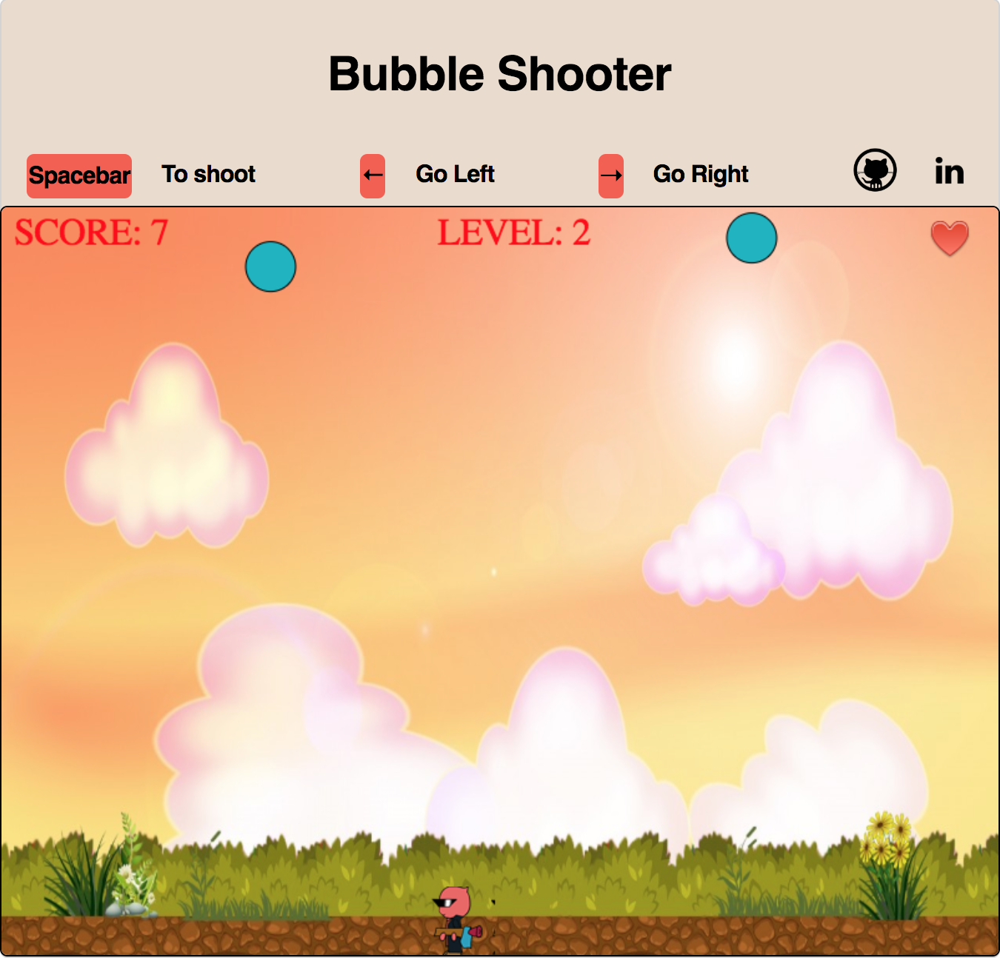

# Bubble Shooter - a shooting game in which you need to shoot toxic bubbles to survive

[Live Demo](https://archhere.github.io/Bubble-Shooter/)

### Background and Overview

 Bubble Shooter is a clone of the Bubble Struggle arcade game.The player controls Travis, a scientist whose experiments go wrong as he becomes trapped in a Bubble world. The goal of the game is to clear the incoming bubble assault. The more bubbles destroyed, the more points scored. A player wins when there are no bubbles remaining on the playing field. The character gets 3 lifes and loses a life everytime a bubble hits him.
 
### Game features

There are 3 levels to the game. If the player wins, he moves on to the next level. If he loses, he starts from the beginning. For the truly enthusiastic player, after completing all the 3 levels, I have implemented a harder version of the 3 levels with the bubbles attacking faster and faster.
 
 Level 1
 
 
 
 Level 2
 
  
  
  Level 3
 
  

 ### Bonus Features
 
 * Add a timer to the levels.
 * Add a variety of audio for each level.
 * Add a different background for each level - Underwater, space etc.

